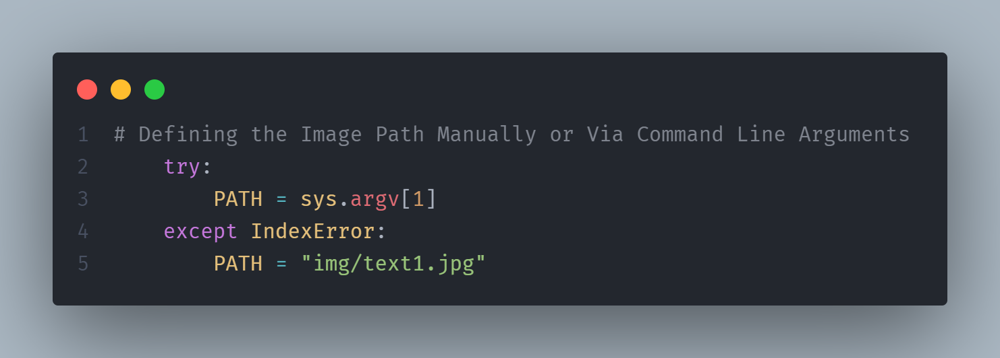

# Risolutore di Cruciverba
Questo è uno script per ottenere le risposte ad un cruciverba, usando pyTesseract e il Web Scraping

## Impostare
Scarica la cartella ZIP o clona il repository con:
```
git clone https://github.com/TonicStark/Crossword-Solver.git
```

Quindi installa le dipendenze in un virtualenv, puoi crearne uno tramite `python -m venv <name of the virtualenv>`, con:
```python
pip install -r requirements.txt
```

Quindi, devi installare quella che viene chiamata **Tesseract**, una libreria per il riconoscimento del testo, in particolare **OCR**. Puoi cercarlo su Github e seguire le istruzioni sul loro Repo. Questo è il [link](https://github.com/tesseract-ocr/tesseract).
Quindi aggiungi la cartella di installazione al tuo **PERCORSO DI SISTEMA** altrimenti lo script **non funzionerà!**. [Qui](https://chlee.co/how-to-setup-environment-variables-for-windows-mac-and-linux/) c'è una guida.

## Come funziona
Per eseguire il programma, devi semplicemente eseguire il file `main.py`. Puoi eseguirlo così com'è e, per impostazione predefinita, utilizzerà una delle sei immagini di prova nella cartella `/img`, in particolare l'immagine `/img/text1.jpg`. Se desideri utilizzare un'immagine diversa, puoi modificare il codice sorgente qui:



oppure puoi eseguire il programma con un flag, un argomento della riga di comando. In particolare, questo comando, `python main.py <percorso della tua immagine>`. Questo prenderà l'immagine che hai selezionato e la userà per l'analisi.

# Avvia lo script
Ora che sai come eseguire il programma, puoi semplicemente farlo. **Buona risoluzione!**