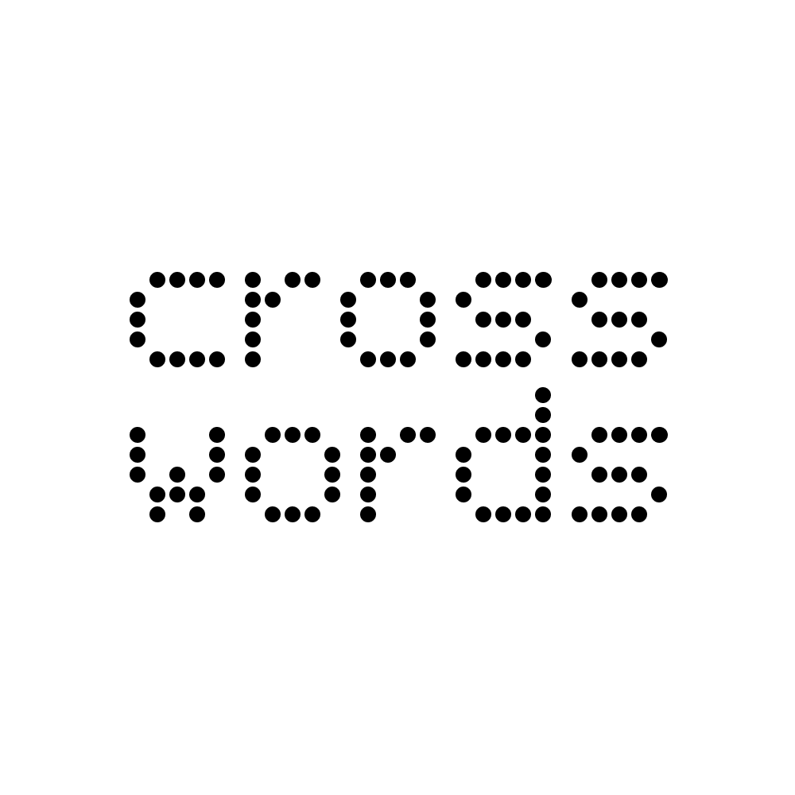

<div align="center">
  
  <h1>🧩 Crosswords: Crossword Puzzle Answer Finder</h1>
</div>

<div align="center">
  <a href="https://www.buymeacoffee.com/saccofrancesco">
    
  </a>
</div>

<h4 align="center">A fast and intuitive crossword solver powered by <a href="https://github.com/madmaze/pytesseract" target="_blank">Tesseract OCR</a> and web scraping — built with <a href="https://streamlit.io" target="_blank">Streamlit</a>.</h4>

<p align="center">
  
  
  
</p>

<p align="center">
  <a href="#tldr">TL;DR</a> •
  <a href="#key-features">Key Features</a> •
  <a href="#quickstart">Quickstart</a> •
  <a href="#credits">Credits</a> •
  <a href="#license">License</a>
</p>

---

## 📌 TL;DR
**Crosswords** helps you solve puzzles by recognizing text with Tesseract OCR and scraping answer databases.  
It runs locally or online via Streamlit — fast, lightweight, and cross-platform.

👉 Try it online: [crosswords.streamlit.app](https://crosswords.streamlit.app)

---

## 🔑 Key Features
* **Efficient Solver** – OCR + web scraping finds answers fast  
* **Real-Time Generation** – Instant suggestions from your clues  
* **Simple UI** – Clean Streamlit interface  
* **Cross-Platform** – Runs on Windows, macOS, and Linux  

---

## ⚡ Quickstart

You’ll need [Git](https://git-scm.com), [Python](https://www.python.org/downloads/), and [pip](https://pip.pypa.io/en/stable/).  

```bash
# Clone this repository
git clone https://github.com/saccofrancesco/crosswords.git
cd crosswords

# Install dependencies
pip install -r requirements.txt

# Install Tesseract (required for OCR)
# Follow instructions: https://github.com/tesseract-ocr/tesseract
# After installation, add Tesseract to your SYSTEM PATH

# Run the app
streamlit run main.py
```

This will start a **local server** (for your device) and a **network server** (accessible across devices on your network).

---

## 🧠 Credits & Acknowledgements

Crosswords uses these great tools:

* [Python](https://www.python.org/)
* [pyTesseract](https://github.com/madmaze/pytesseract)
* [Streamlit](https://streamlit.io/)
* [BeautifulSoup](https://www.crummy.com/software/BeautifulSoup/bs4/doc/)

---

## 📎 You Might Also Like...

Explore more by the same author:

* [SupremeBot](https://github.com/saccofrancesco/supreme-bot): A Supreme shopping bot built with [NiceGUI](https://nicegui.io).
* [Lock](https://github.com/saccofrancesco/lock): A secure local password manager built with [CustomTkinter](https://customtkinter.tomschimansky.com/).

---

## 📜 License

This project is licensed under **Attribution - NonCommercial - ShareAlike 4.0 International**.
See the [LICENSE](./LICENSE) file for details.

---

> GitHub [@saccofrancesco](https://github.com/saccofrancesco)